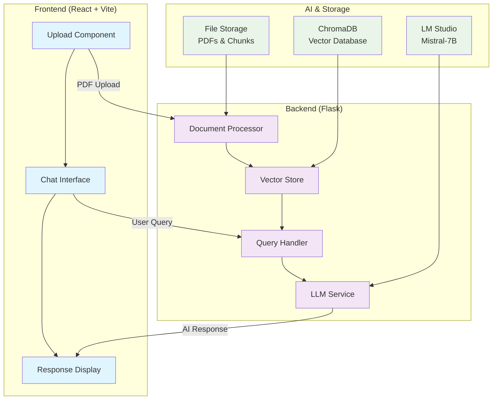

# HR Onboarding Knowledge Assistant

An AI-powered HR assistant that helps employees quickly find information about company policies, benefits, and procedures from uploaded HR documents.

## 🚀 Features

- **PDF Document Upload**: Upload multiple HR documents (handbooks, policies, guides)
- **AI-Powered Q&A**: Natural language queries about HR policies and procedures
- **Smart Search**: Vector-based semantic search across all uploaded documents
- **Source Citations**: Answers include references to source documents
- **Real-time Chat**: Interactive chat interface for employee queries
- **Multi-Document Support**: Handle multiple HR documents simultaneously
- **Persistent Storage**: Documents remain available after browser refresh

## 🏗️ Architecture

**Frontend**: React + Vite + Chakra UI  
**Backend**: Flask + Python  
**AI Model**: LM Studio (Mistral-7B-instruct-v0.1)  
**Vector Database**: ChromaDB  
**Text Processing**: PyPDF2 + sentence-transformers  

## 📋 Prerequisites

- **Python 3.8+**
- **Node.js 16+** 
- **LM Studio** (for local AI inference)
- **Git**

## 🔧 Installation

### 1. Clone the Repository

```bash
git clone https://github.com/shubham587/hr-assistant.git
```

### 2. Backend Setup

```bash
# Navigate to backend directory
cd backend

# Create virtual environment
python -m venv venv

# Activate virtual environment
# On macOS/Linux:
source venv/bin/activate
# On Windows:
venv\Scripts\activate

# Install dependencies
pip install -r requirements.txt

# Start the backend server
python app.py
```

The backend will start on `http://localhost:5001`

### 3. Frontend Setup

```bash
# Navigate to frontend directory (from project root)
cd frontend

# Install dependencies
npm install

# Start the development server
npm run dev
```

The frontend will start on `http://localhost:5173`

### 4. LM Studio Setup

1. **Download LM Studio**: [https://lmstudio.ai/](https://lmstudio.ai/)
2. **Download Model**: Search and download "Mistral-7B-instruct-v0.1"
3. **Load Model**: Load the model in LM Studio
4. **Start Server**: Enable the local server on port 1234

## 🎯 Usage Examples

### Sample HR Questions You Can Ask:

#### **Benefits & Compensation**
- "What are the health insurance options?"
- "How does the 401k matching work?"
- "What's covered under dental insurance?"
- "How much vacation time do I get?"

#### **Policies & Procedures**
- "What's the remote work policy?"
- "How do I request time off?"
- "What's the dress code for client meetings?"
- "How do I report a workplace incident?"

#### **Performance & Development**
- "When do performance reviews happen?"
- "How are performance ratings calculated?"
- "What training programs are available?"
- "How do I set up a development plan?"

### Sample Documents to Upload:
1. **Employee Handbook** - General policies and procedures
2. **Benefits Guide** - Health insurance, retirement plans
3. **Performance Review Guide** - Appraisal processes and criteria
4. **Remote Work Policy** - Work-from-home guidelines
5. **Code of Conduct** - Behavioral expectations

## 🔄 System Workflow

### Document Processing Flow:
1. **Upload PDF** → Frontend sends file to backend
2. **Text Extraction** → PyPDF2 extracts text from PDF
3. **Chunking** → Text split into 500-word chunks with overlap
4. **Embedding** → Generate vector embeddings using sentence-transformers
5. **Storage** → Store in ChromaDB for semantic search

### Query Processing Flow:
1. **User Query** → Employee asks HR question
2. **Vector Search** → Find relevant document chunks
3. **Context Assembly** → Combine relevant chunks
4. **AI Generation** → LM Studio generates response
5. **Source Citation** → Include document references
6. **Response Display** → Show answer with sources

## 🎨 System Architecture Diagram



## 🛠️ Development

### Project Structure
```
hr-assistant/
├── backend/
│   ├── app.py                 # Flask application
│   ├── document_processor.py  # PDF processing
│   ├── vector_store.py        # ChromaDB integration
│   ├── llm_service.py         # LM Studio interface
│   ├── query_handler.py       # RAG pipeline
│   ├── requirements.txt       # Python dependencies
│   └── venv/                  # Virtual environment
├── frontend/
│   ├── src/
│   │   ├── components/
│   │   │   ├── FileUpload.jsx
│   │   │   └── ChatInterface.jsx
│   │   ├── App.jsx
│   │   └── main.jsx
│   ├── package.json
│   └── node_modules/
├── data/
│   ├── documents/             # Uploaded PDFs
│   ├── chunks/                # Processed text chunks
│   └── chroma_db/            # Vector database
├── README.md
└── .gitignore
```

### Key Configuration

#### Backend Configuration (`backend/app.py`)
- **Port**: 5001
- **CORS**: Enabled for frontend communication
- **Debug Mode**: Enabled for development
- **File Upload**: Max 10MB PDF files

#### Frontend Configuration (`frontend/vite.config.js`)
- **Port**: 5173
- **Proxy**: API calls routed to backend
- **Hot Reload**: Enabled for development

### API Endpoints

#### `POST /upload`
Upload PDF documents for processing
- **Body**: multipart/form-data with PDF file
- **Response**: Success/error message

#### `POST /chat`
Send queries to the HR assistant
- **Body**: `{"query": "your question here"}`
- **Response**: `{"response": "answer", "sources": [...], "confidence": "high"}`

#### `GET /health`
Check system health status
- **Response**: Service status for all components


